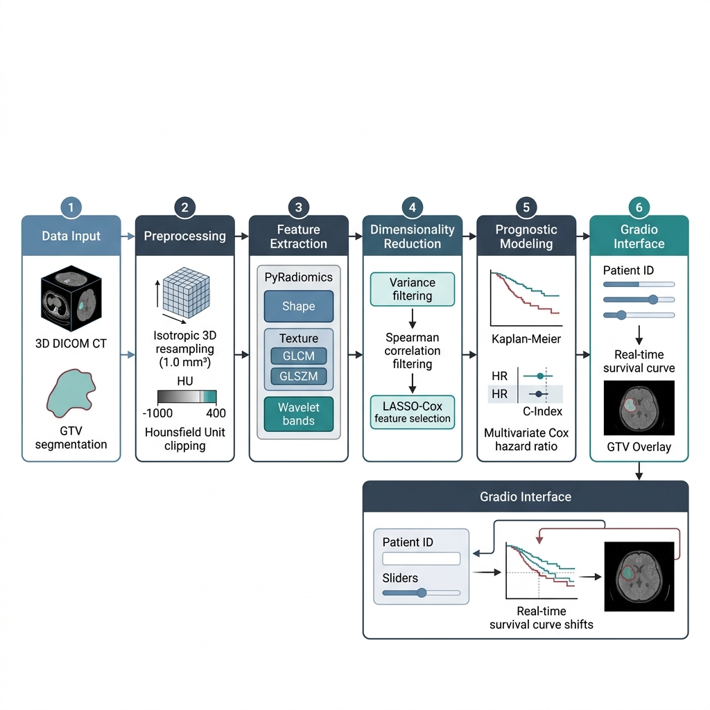
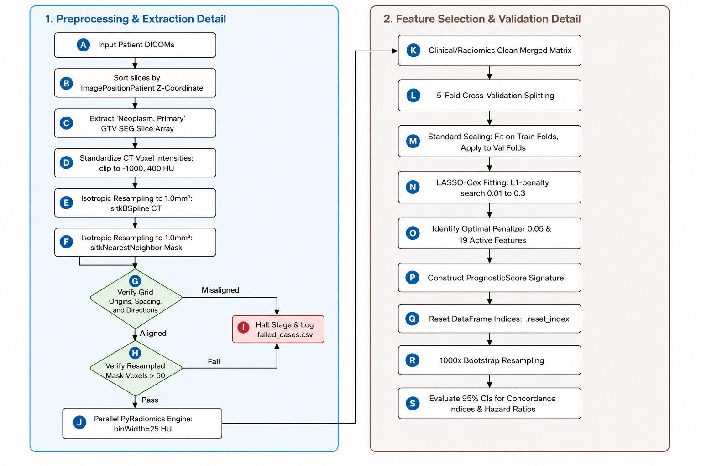

# NSCLC Tumors Radiomics & Clinical Association Research Pipeline

This repository contains the end-to-end, reproducible radiomics research pipeline for the benchmark **TCIA NSCLC-Radiomics Lung1** dataset. The project is structured, validated, and documented to comply with the methodological standards of radiomics research, medical physics guidelines, and scientific publication peer review.

---

## 1. Project Overview

The core objective of this project is the **Quantitative Radiomic Characterization of NSCLC Tumors and Their Association with Clinical Outcomes**.

It provides a reproducible pipeline to:
1. Parse CT DICOM scans and coordinate-align them with corresponding binary DICOM SEG files.
2. Standardize scans via intensity clipping (HU scaling) and isotropic resampling ($1.0 \text{ mm}^3$).
3. Extract 889 quantitative shape, first-order, and wavelet texture features inside the Gross Tumor Volume (GTV).
4. Perform feature cleaning (variance and Spearman correlation redundancy filters).
5. Run univariate statistical testing (Mann-Whitney U, Kruskal-Wallis, Spearman) with Benjamini-Hochberg FDR multiple-testing correction.
6. Fit univariate and cross-validated multivariate LASSO-Cox Proportional Hazards models to construct a prognostic radiomics signature.
7. Generate publication-quality Kaplan-Meier survival curves, forest plots, and correlation clustermaps.

---
## 2. Live Demo

> **Click the thumbnail below to watch the full project demonstration on YouTube.**

[](https://www.youtube.com/watch?v=w0k_5CbNT88)

---

## 3. Architecture & Methodology

Below is the system architecture diagram illustrating the end-to-end quantitative radiomics pipeline, from data ingestion to prognostic model evaluation and the demonstrator application:





---

## 4. Repository Structure

```
radiomics/
├── .agents/                      # Workspace customizations
│   └── AGENTS.md                 # Project-scoped agent rules
├── dataset/                      # Read-only dataset folder
│   ├── NSCLC-Radiomics/          # 422 patient directories (LUNG1-001 ... LUNG1-422)
│   └── NSCLC-Radiomics-Lung1.clinical-version3-Oct-2019.csv
├── src/                          # Pipeline modules
│   ├── __init__.py
│   ├── config.yaml               # Master configuration file
│   ├── utils.py                  # Logging and YAML config helpers
│   ├── data_ingestion.py         # Stage 2: DICOM manifest scanner
│   ├── preprocessing.py          # Stage 3: Coordinates matching, HU clipping, resampling
│   ├── feature_extraction.py     # Stage 4: Parallel PyRadiomics loop with LokyBackend
│   ├── analysis.py               # Stage 5 & 6: Data cleaning and statistical tests
│   └── survival.py               # Stage 7: Cox modeling, CV LASSO-Cox, KM plotting
├── outputs/                      # Generated research output
│   ├── features/                 # Checkpoints, raw features, and cleaned features matrix
│   ├── figures/                  # Clustermaps, PCA projection, KM curves, forest plots
│   ├── tables/                   # Clinical summaries, stats, univariate and multivariate Cox outputs
│   └── logs/                     # Pipeline logs and failed_cases.csv
├── run_pipeline.py               # Entry-point orchestrator script
├── requirements.txt              # Pinned Python package dependencies
├── rules.md                      # Compilation of 41 operational boundaries
├── progress.md                   # Development history and stage status log
├── implementation_plan.md        # Technical execution plan
└── README.md                     # This file
```

---

## 5. Installation & Setup

This project uses Python 3.9 (recommended to avoid compilation issues with PyRadiomics C-extensions on newer Python versions) and `uv` for fast virtual environment management.

### Step 1: Create Virtual Environment
Recreate the virtual environment using Python 3.9:
```powershell
uv venv --python 3.9
```

### Step 2: Activate Environment
Activate the environment:
* **Windows (PowerShell)**: `.venv\Scripts\activate`
* **Linux/macOS**: `source .venv/bin/activate`

### Step 3: Install Dependencies
Install all package dependencies:
```powershell
uv pip install -r requirements.txt
```

---

## 6. Execution Guide

You can run the end-to-end pipeline or execute specific stages using `run_pipeline.py`.

### Run All Stages (Ingestion, Extraction, Cleaning, Statistics, Survival)
```powershell
python run_pipeline.py --stage all
```

### Run Stage 2: Data Ingestion
Scans clinical data and builds patient file path mappings. Correctly flags missing segmentations.
```powershell
python run_pipeline.py --stage ingestion
```

### Run Stage 4: Radiomic Feature Extraction
Extracts features in parallel using LokyBackend across all available CPU threads. Implements checkpointing (saving incremental temporary files) so interrupted runs can be resumed instantly.
```powershell
python run_pipeline.py --stage extraction
```

### Run Stage 5 & 6: Data Cleaning & Statistical Analysis
Performs variance filtering ($Var < 0.01$), Spearman correlation redundancy filtering ($|\rho| > 0.95$), univariate associations with Benjamini-Hochberg FDR correction, and generates PCA and correlation figures.
```powershell
python run_pipeline.py --stage analysis
```

### Run Stage 7: Survival Analysis & Prognostic Modeling
Fits univariate Cox models, tunes a cross-validated LASSO-Cox model, builds a Prognostic Score signature, and performs bootstrap validation (1000 resamples), time-dependent ROC calculations (1, 3, 5-year AUCs), 3-year calibration, model comparisons, and feature meaning mapping. Plots stratified Kaplan-Meier curves, calibration curves, ROC curves, and forest plots.
```powershell
python run_pipeline.py --stage survival
```

---

## 7. Summary of Core Outputs

All outputs are saved to the `outputs/` directory:
* **Logs & Manifests**:
  * `outputs/logs/data_manifest.csv` — Full listing of CT/SEG paths and validation status.
  * `outputs/logs/failed_cases.csv` — Patients excluded (e.g. `LUNG1-128` missing segmentation).
* **Features Matrices**:
  * `outputs/features/raw_features_all_patients.csv` — Aggregated $421 \times 889$ raw features matrix.
  * `outputs/features/cleaned_feature_matrix.csv` — Cleaned, non-redundant $421 \times 190$ features matrix.
  * `outputs/features/pyradiomics_params.yaml` — Exact PyRadiomics configuration used.
* **Tables**:
  * `outputs/tables/clinical_summary.csv` — Descriptive statistics of patient metadata.
  * `outputs/tables/univariate_associations.csv` — Stage, histology, and status association p-values and effect sizes.
  * `outputs/tables/cox_univariate_results.csv` — Standardized HRs and C-indexes for all features.
  * `outputs/tables/cox_multivariate_results.csv` — Multivariate Cox model HRs, 95% Wald CIs, bootstrap-derived 95% CIs, and C-index.
  * `outputs/tables/model_comparison.csv` — Concordance indices and 95% Bootstrap CIs comparing Clinical, Radiomics, and Combined models.
  * `outputs/tables/feature_meanings.csv` — Physical definitions and biological interpretations for the 19 selected features.
* **Figures**:
  * `outputs/figures/correlation_heatmap.png` — Clustered correlation matrix of cleaned features.
  * `outputs/figures/pca_plots.png` — PC1 vs PC2 projection colored by Stage and Histology.
  * `outputs/figures/feature_boxplots_survival.png` — Top features associated with survival status.
  * `outputs/figures/km_overall_survival.png` — KM curve of overall survival.
  * `outputs/figures/km_survival_by_stage.png` — KM curves stratified by Overall Stage (with risk tables).
  * `outputs/figures/km_survival_by_histology.png` — KM curves stratified by Histology.
  * `outputs/figures/km_survival_by_gender.png` — KM curves stratified by Gender.
  * `outputs/figures/km_survival_by_top_feature.png` — KM curves stratified by the top radiomic feature (median split).
  * `outputs/figures/km_radiomic_signature.png` — Stratification by Radiomic Signature (with risk tables and C-index).
  * `outputs/figures/cox_multivariate_forest.png` — Forest plot of Hazard Ratios in the multivariate model.
  * `outputs/figures/time_dependent_roc.png` — Time-dependent ROC curves plotting 1-year, 3-year, and 5-year AUCs.
  * `outputs/figures/calibration_plot_3yr.png` — Calibration curve comparing predicted vs Kaplan-Meier observed 3-year survival.

---

## 8. Limitations & Technical Cautions

1. **Single-Center scanner protocol bias**: Scanning protocols (slice thickness, kernel) are highly uniform in Lung1, which may cause overfitting to acquisition parameters.
2. **Missing Segmentation**: Patient `LUNG1-128` was excluded due to a missing segment.
3. **FDR Conservatism**: Binary survival status shows no univariate associations after BH FDR correction, showing the need for multivariate modeling.
4. **Retrospective Endpoints**: Confounders like variable chemotherapy or immunotherapy regimes were not controlled for.

---

## 9. Citations & Data Usage Policy

### Dataset Acquisition
The benchmark cohort dataset can be downloaded directly from The Cancer Imaging Archive (TCIA):
* **TCIA Collection Link**: [NSCLC-Radiomics Collection](https://www.cancerimagingarchive.net/collection/nsclc-radiomics/)

### Data Citation Required
Users must abide by the TCIA Data Usage Policy and Restrictions. Attribution must include the following citation, including the Digital Object Identifier:

* **Data Citation**:
  Aerts, H. J. W. L., Wee, L., Rios Velazquez, E., Leijenaar, R. T. H., Parmar, C., Grossmann, P., Carvalho, S., Bussink, J., Monshouwer, R., Haibe-Kains, B., Rietveld, D., Hoebers, F., Rietbergen, M. M., Leemans, C. R., Dekker, A., Quackenbush, J., Gillies, R. J., Lambin, P. (2014). Data From NSCLC-Radiomics (version 4) [Data set]. The Cancer Imaging Archive. https://doi.org/10.7937/K9/TCIA.2015.PF0M9REI
