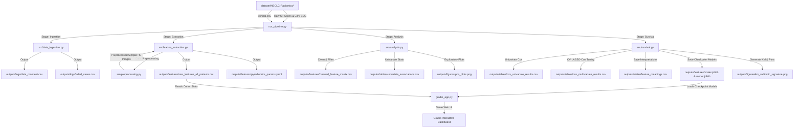

# Pipeline Architecture: NSCLC Radiomics Research Suite

This document describes the software and data architecture of the reproducible NSCLC Radiomics Pipeline.

## 1. System Architecture Diagram

---

## 2. Core Components and Responsibilities

1.  **Entry Point Orchestrator ([run_pipeline.py](file:///d:/Coding/radiomics/run_pipeline.py))**:
    CLI entry point that triggers specific research stages or executes the pipeline sequentially: Ingestion $\rightarrow$ Extraction $\rightarrow$ Analysis $\rightarrow$ Survival.
2.  **Data Ingestion ([src/data_ingestion.py](file:///d:/Coding/radiomics/src/data_ingestion.py))**:
    Parses directory structures, locates the corresponding CT and segmentation series, validates patient clinical records, and logs excluded patients to `failed_cases.csv` with detailed failure reasoning.
3.  **Preprocessing Layer ([src/preprocessing.py](file:///d:/Coding/radiomics/src/preprocessing.py))**:
    Standardizes raw medical image data. Sorts CT slices by Z-position metadata, extracts and coordinate-aligns the target segment ("Neoplasm, Primary"), clips intensity range to Hounsfield Units [-1000, 400], and performs isotropic resampling ($1.0\text{ mm}^3$) with verification.
4.  **Parallel Extraction Engine ([src/feature_extraction.py](file:///d:/Coding/radiomics/src/feature_extraction.py))**:
    Extracts 889 features from the GTV region in parallel using `joblib`'s `LokyBackend`. Implements temp-file check-pointing for failure recovery and consolidates outputs into `raw_features_all_patients.csv`.
5.  **Statistical Analysis ([src/analysis.py](file:///d:/Coding/radiomics/src/analysis.py))**:
    Performs feature cleaning (variance filtering and Spearman correlation redundancy filtering) and calculates univariate clinical association statistics corrected for multiple-testing via Benjamini-Hochberg FDR.
6.  **Survival Modeling ([src/survival.py](file:///d:/Coding/radiomics/src/survival.py))**:
    Fits univariate Cox PH models, cross-validates a LASSO-regularized Cox model to extract a 19-feature Prognostic Score signature, and conducts bootstrap validations (1000 resamples), time-dependent ROCs, and calibration testing. Saves model artifacts using `joblib`.
7.  **Interactive Dashboard ([gradio_app.py](file:///d:/Coding/radiomics/gradio_app.py))**:
    A Gradio web interface that loads pre-fit models, displays patient demographics and GTV segment contours overlaid on axial CT slices, and allows real-time prognosis simulation via feature sliders.
