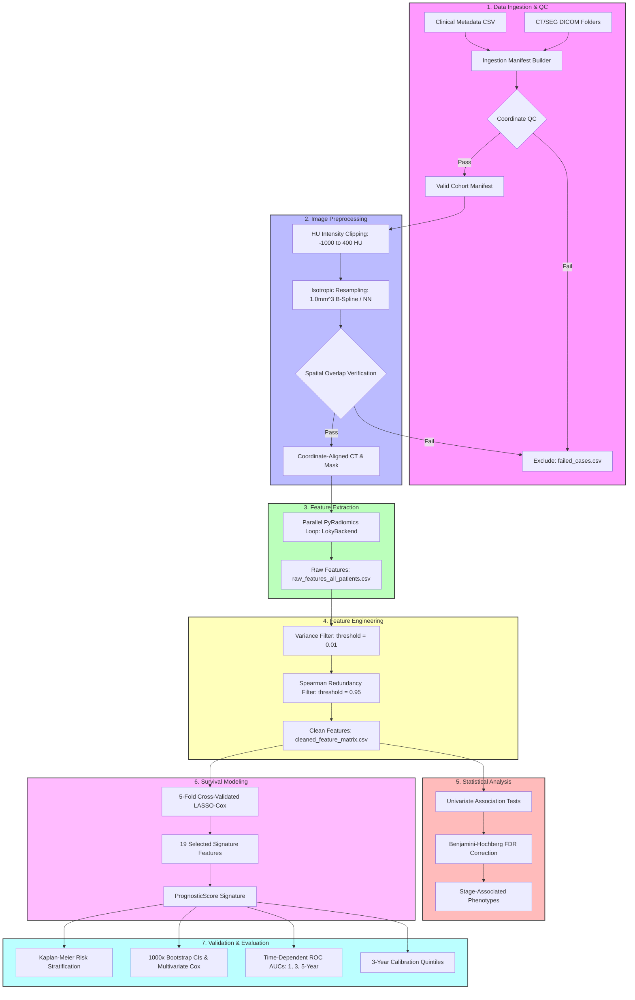

# Radiomics Pipeline Architecture Diagram

This document contains a Mermaid flowchart depicting the high-level pipeline architecture from clinical and image data ingestion to prognostic validation.

