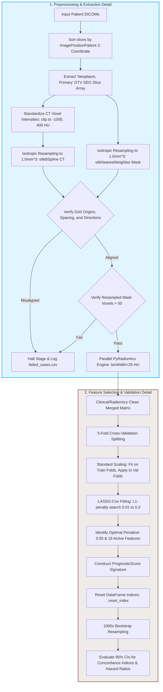

# Detailed Preprocessing and Modeling Methodology Flowchart

This document contains a Mermaid flowchart mapping the detailed image preprocessing steps and cross-validated modeling pipeline.

```mermaid
graph TD
    subgraph PreprocessingFlow ["1. Preprocessing & Extraction Detail"]
        A[Input Patient DICOMs] --> B[Sort slices by ImagePositionPatient Z-Coordinate]
        B --> C[Extract 'Neoplasm, Primary' GTV SEG Slice Array]
        C --> D[Standardize CT Voxel Intensities: clip to -1000, 400 HU]
        D --> E[Isotropic Resampling to 1.0mm^3: sitkBSpline CT]
        C --> F[Isotropic Resampling to 1.0mm^3: sitkNearestNeighbor Mask]
        E --> G{Verify Grid Origins, Spacing, and Directions}
        F --> G
        G -->|Aligned| H{Verify Resampled Mask Voxels > 50}
        G -->|Misaligned| I[Halt Stage & Log failed_cases.csv]
        H -->|Pass| J[Parallel PyRadiomics Engine: binWidth=25 HU]
        H -->|Fail| I
    end
    subgraph ModelingFlow ["2. Feature Selection & Validation Detail"]
        J --> K[Clinical/Radiomics Clean Merged Matrix]
        K --> L[5-Fold Cross-Validation Splitting]
        L --> M[Standard Scaling: Fit on Train Folds, Apply to Val Folds]
        M --> N[LASSO-Cox Fitting: L1-penalty search 0.01 to 0.3]
        N --> O[Identify Optimal Penalizer 0.05 & 19 Active Features]
        O --> P[Construct PrognosticScore Signature]
        P --> Q[Reset DataFrame Indices: .reset_index]
        Q --> R[1000x Bootstrap Resampling]
        R --> S[Evaluate 95% CIs for Concordance Indices & Hazard Ratios]
    end

    style PreprocessingFlow fill:#e1f5fe,stroke:#03a9f4,stroke-width:2px
    style ModelingFlow fill:#efebe9,stroke:#795548,stroke-width:2px
```
