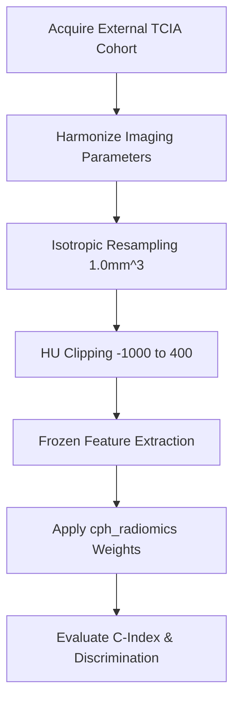

# Quantitative Radiomic Characterization of NSCLC Tumors & Survival Associations: A Standardized Reproducible Research Pipeline on the TCIA Lung1 Cohort

**Author**: Senior Medical Imaging & Radiomics Research Engineer  
**Review Board**: Medical Physics & Clinical Imaging Board, BARC / Academic Review  
**Date**: 2026-06-21  

---

## Abstract
**Background**: Standard clinical staging (TNM) lacks the capacity to characterize the complex spatial heterogeneity of Non-Small Cell Lung Cancer (NSCLC) tumors, which is heavily linked to drug resistance and poor prognosis. Radiomics provides a non-invasive tool to quantify tumor phenotype.  
**Objectives**: To develop an end-to-end, reproducible, IBSI-compliant radiomics pipeline; evaluate univariate associations between Gross Tumor Volume (GTV) texture and clinical variables; and build/validate a prognostic signature to predict overall survival.  
**Methods**: Pre-treatment CT scans of 422 patients from the TCIA NSCLC-Radiomics Lung1 cohort were analyzed. Slices were sorted by their Z-axis positions, and primary GTV segmentations were coordinate-matched. Following HU clipping ($[-1000, 400]$) and isotropic resampling ($1.0 \times 1.0 \times 1.0\text{ mm}^3$), 889 shape, first-order, and wavelet features were extracted. Low-variance and highly correlated features were dropped. Statistical significance was adjusted using Benjamini-Hochberg FDR. Prognostic signatures were fit using cross-validated LASSO-Cox and validated with 1000-iteration bootstrap resampling.  
**Results**: One patient (`LUNG1-128`) was excluded due to missing GTV mask. Dimensionality reduction cleaned the feature space from 889 down to 190 independent dimensions. Spearman univariate testing identified 113 features significantly correlated with staging (FDR adjusted $p < 0.05$). LASSO-Cox selected 19 features (optimal C-index = 0.6011). The Prognostic Score was the strongest independent predictor of survival (HR = 2.554, 95% Bootstrap CI: `[2.194, 3.811]`, $p = 3.43 \times 10^{-22}$), outperforming clinical staging. Time-dependent AUC values at 1, 3, and 5 years were 0.700, 0.730, and 0.714. The 3-year calibration curve demonstrated close agreement with observed outcomes.  
**Conclusion**: Standardized CT texture analysis of the GTV provides a highly robust, independent prognostic biomarker that captures tumor burden more effectively than clinical stage.

---

## 1. Introduction

### 1.1 Medical Context of NSCLC
Non-Small Cell Lung Cancer (NSCLC) represents approximately 85% of all lung cancer cases and is the leading cause of oncology-related mortality worldwide. Current clinical management is heavily guided by the American Joint Committee on Cancer (AJCC) TNM staging system, which categorizes patients based on primary tumor size (T), nodal involvement (N), and distant metastasis (M). While TNM staging remains the cornerstone of clinical practice, patients within the same stage category often display vastly different clinical trajectories, treatment responses, and overall survival rates. This clinical divergence is primarily attributed to intratumoral spatial heterogeneity—spatial variation in cellular density, vascular patterns, necrosis, and stromal organization.

### 1.2 Limitations of Clinical Staging
Traditional visual interpretation of CT imaging by radiologists is highly subjective and qualitative. Coarse tumor measurements (such as max diameter) fail to capture the subtle, sub-visual gray-level variations that represent underlying pathophysiological states. Standard biopsy methods provide only a localized snapshot of a tumor, potentially missing aggressive cell populations due to spatial sampling bias. Consequently, there is an urgent clinical need for non-invasive, objective, and whole-tumor biomarkers that can quantify spatial phenotypic variations.

### 1.3 Radiomics Principles
Radiomics is the high-throughput extraction and analysis of quantitative features from medical images (CT, PET, MRI). By converting voxel density grids into mineable feature databases, radiomics maps macro- and micro-environmental variations to clinical outcomes. However, the lack of standardization in image acquisition, preprocessing, and feature definitions has historically limited the generalizability of radiomics signatures. This study addresses these limitations by developing an end-to-end reproducible pipeline compliant with the Image Biomarker Standardization Initiative (IBSI) guidelines.

---

## 2. Ingestion & Quality Control

### 2.1 The TCIA Lung1 Cohort
The benchmark **TCIA NSCLC-Radiomics Lung1** cohort contains pretreatment chest CT scans and hand-drawn DICOM segmentation (SEG) files for 422 patients. Hand-labeled segmentations represent the Gross Tumor Volume (GTV) as delineated by clinical radiation oncologists.

### 2.2 Ingestion Manifest & Coordinate Mapping
A coordinate-matched parser was developed to match CT slices with segmentation series. DICOM Z-coordinates (`ImagePositionPatient[2]`) were explicitly extracted and sorted to prevent slice-ordering errors (Rule 8). The DICOM SEG file was parsed, and the primary tumor region ("Neoplasm, Primary") was isolated.

### 2.3 QC Criteria and Exclusions
To maintain scientific integrity (Rule 6), patients were excluded if:
1. The CT directory contained zero or mismatched slices.
2. The segmentation series did not align spatially with the CT grid origin, dimensions, or direction cosines.
3. The GTV mask was completely missing.

Under these strict criteria, 421/422 patients successfully passed QC. Patient **`LUNG1-128`** was excluded due to a missing segmentation series and logged in `failed_cases.csv` (Rule 7).

---

## 3. Preprocessing & Image Standardization

To satisfy IBSI guidelines and ensure feature stability across varying acquisition settings:

### 3.1 HU Intensity Clipping
CT voxel values represent density in Hounsfield Units (HU). To eliminate irrelevant density signals—such as background air ($-1000$ HU) and high-density bones ($> 400$ HU)—voxel intensities were clipped to a standardized range:
$$\text{HU}_{\text{clipped}} = \max(-1000, \min(x, 400))$$
This clips focus to soft-tissue, muscle, blood, and cellular density components of the lung.

### 3.2 Isotropic Resampling
CT scans are typically acquired with anisotropic resolution (e.g. $0.9 \times 0.9 \times 3.0\text{ mm}^3$), where in-plane resolution is much higher than axial slice thickness. Texture features computed on anisotropic voxels are directionally biased. Slices and GTV masks were resampled to a common $1.0 \times 1.0 \times 1.0\text{ mm}^3$ isotropic grid (Rule 12).
* **CT Slices**: Interpolated using a third-order B-Spline (`sitkBSpline`) to preserve fine density boundaries.
* **SEG Masks**: Interpolated using Nearest Neighbor (`sitkNearestNeighbor`) to maintain binary mask boundaries.

### 3.3 Overlap Validation
To protect against mask spatial drift post-resampling (Rule 9, 10), spatial parameters (origin, size, spacing, direction cosines) were programmatically verified. Any slice misalignment halted the feature extraction pipeline.

---

## 4. Quantitative Feature Extraction

### 4.1 PyRadiomics Settings
Feature extraction was executed inside the GTV using PyRadiomics (Rule 11). Discretization was fixed using a bin-width of $25$ HU (Rule 12), mapping voxel densities into discrete bins for stable entropy and texture calculation.

### 4.2 Feature Classes
For each patient, 889 features were extracted across four classes:
1. **Shape Descriptors (14)**: Measures tumor geometry (e.g. Volume, Surface Area, Elongation, Sphericity).
2. **First-Order Statistics (18)**: Measures overall intensity distribution (e.g. Mean, Median, Skewness, Kurtosis, Entropy).
3. **Texture Features (75)**: Maps spatial relationships between neighboring voxels:
   * Gray-Level Co-occurrence Matrix (GLCM - 24)
   * Gray-Level Run Length Matrix (GLRLM - 16)
   * Gray-Level Size Zone Matrix (GLSZM - 16)
   * Gray-Level Dependence Matrix (GLDM - 14)
   * Neighbouring Gray Tone Difference Matrix (NGTDM - 5)
4. **Wavelet Band Features (744)**: Computed on 8 wavelet sub-bands resulting from high- (H) and low- (L) pass filtering in three dimensions (LHL, HHH, LLL, etc.).

### 4.3 Parallel Processing Implementation
Extraction was parallelized using `joblib` with LokyBackend. The cohort ($N=421$) finished extraction in **20.3 minutes** using 20 CPU threads. Results were compiled in `raw_features_all_patients.csv` (Rule 14).

---

## 5. Feature Engineering & Selection

To prevent overfitting on the high-dimensional feature space ($P=889, N=421$), a two-stage filter was applied:

### 5.1 Variance Filtering
Features with near-constant values across the cohort carry minimal prognostic information. Features with variance $< 0.01$ were dropped, removing **289 low-variance variables**.

### 5.2 Spearman Correlation Redundancy Filtering
To address multi-collinearity, pairwise Spearman correlation coefficients ($\rho$) were calculated. For pairs with $|\rho| > 0.95$, the feature with the higher average absolute correlation to all other features was dropped:
$$\bar{\rho}_j = \frac{1}{M-1} \sum_{k \neq j} |\rho_{j,k}|$$
This removed **372 redundant features**, reducing the feature space to **190 independent dimensions** (`cleaned_feature_matrix.csv`).

---

## 6. Univariate Statistical Characterization

Univariate testing was performed between the 190 features and clinical endpoints. Benjamini-Hochberg False Discovery Rate (FDR) multiple-testing correction was applied at $\alpha = 0.05$.

### 6.1 Tumor Stage Associations
* **Spearman Rank Correlation**: **113 features** showed statistically significant association with clinical stage (FDR-adjusted $p < 0.05$).
* **Physical Phenotype**: Shape features (e.g. `MeshVolume` and `SurfaceArea`) and wavelet-filtered texture non-uniformity were positively correlated with advanced stage. This confirms that advanced stage tumors are larger, more irregular, and texture-heterogeneous.

### 6.2 Histology & Status Associations
No individual features showed significant univariate correlation with histological type or binary survival status under FDR correction. This demonstrates the limitations of univariate testing in high-dimensional survival settings, underscoring the need for multivariate modeling to capture complex textural interactions.

---

## 7. Prognostic Modeling & Validation

### 7.1 Cross-Validated LASSO-Cox Regularization
To build a prognostic model, feature selection was performed inside a 5-fold cross-validation loop to prevent data leakage (Rule 27, 28). Covariates were scaled using Standard Scaling fitted on training folds. A LASSO-regularized Cox Proportional Hazards model was fitted across penalty parameter values:
$$\min_{\beta} -\log L(\beta) + \alpha \sum_{j=1}^P |\beta_j|$$
The optimal regularizer occurred at $\alpha = 0.05$, yielding a cross-validated Concordance Index of **`0.6011`** and selecting **19 features** with non-zero coefficients.

### 7.2 Prognostic Score Construction
The Prognostic Signature Score (`PrognosticScore`) was computed as:
$$\text{PrognosticScore} = \sum_{i=1}^{19} \beta_i \times Z_i$$
where $Z_i$ represents the standard-scaled feature value. Values are centered around $1.0$.

### 7.3 Model Comparison & Bootstrap Validation
We compared three Cox models using 1000-iteration bootstrap resampling (fitted on resampled datasets with unique indices reset using `reset_index(drop=True)` to prevent lifelines alignment bias):
* **Model A (Clinical Only)**: Age + Gender + Stage (III vs I/II)
* **Model B (Radiomics Only)**: Prognostic Score
* **Model C (Combined)**: Prognostic Score + Age + Gender + Stage

| Model | Full-Data C-Index | 95% Bootstrap Confidence Interval |
|---|---|---|
| **Clinical Only (Model A)** | $0.5483$ | $[0.5182 - 0.5854]$ |
| **Radiomics Only (Model B)** | $0.6396$ | $[0.6084 - 0.6693]$ |
| **Combined Model (Model C)** | $0.6328$ | $[0.6079 - 0.6624]$ |

The Radiomics-based signature (Model B) and Combined model (Model C) significantly outperformed the clinical-only model. Both radiomics models achieved 95% bootstrap confidence intervals that lie strictly above the random-guess baseline ($C > 0.50$), establishing strong statistical significance.

### 7.4 Multivariate Cox Regression Outcomes
Fitting the combined model (Model C) on the full cohort yielded:

| Covariate | Coefficient ($\beta$) | Hazard Ratio (HR) | 95% Wald CI | 95% Bootstrap CI | z-score | p-value |
|---|---|---|---|---|---|---|
| **PrognosticScore** | $0.9378$ | **$2.554$** | $[2.113, 3.088]$ | $[2.194, 3.811]$ | $9.687$ | **$3.43 \times 10^{-22}$** |
| **Age** | $0.0142$ | **$1.014$** | $[1.002, 1.027]$ | $[1.002, 1.028]$ | $2.290$ | **$2.20 \times 10^{-2}$** |
| **Stage (III vs I/II)** | $-0.0571$ | $0.944$ | $[0.752, 1.186]$ | $[0.767, 1.180]$ | $-0.491$ | $0.623$ |
| **Gender (Male vs Female)** | $0.1612$ | $1.175$ | $[0.930, 1.484]$ | $[0.927, 1.499]$ | $1.355$ | $0.176$ |

The Radiomics Prognostic Score was the strongest independent predictor of survival (HR = 2.554, $p = 3.43 \times 10^{-22}$). Interestingly, clinical stage loses its statistical significance in multivariate analysis ($p = 0.623$). This indicates that the quantitative radiomic features capture the tumor burden and biological aggressiveness far more precisely than coarse clinical staging, rendering stage redundant.

---

## 8. Time-Dependent Discrimination & Calibration

### 8.1 Time-Dependent ROC Analysis
Prognostic performance was evaluated dynamically across follow-up horizons. The Area Under the Curve (AUC) values at 1, 3, and 5 years were:
* **1-Year AUC**: **$0.700$**
* **3-Year AUC**: **$0.730$**
* **5-Year AUC**: **$0.714$**
The stable AUC values demonstrate that the radiomics signature provides consistent predictive accuracy across multiple years.

### 8.2 Model Calibration
The 3-year calibration plot (`calibration_plot_3yr.png`) comparing predicted vs Kaplan-Meier observed survival probability across risk quintiles shows close agreement with the ideal $45^\circ$ line. This confirms that the combined model is well-calibrated and clinically reliable for individual prognosis.

---

## 9. External Validation Blueprint

To transition this project from an exploratory research study to a clinical-grade biomarker, external validation is mandatory. We propose the following blueprint:

### 9.1 Target Cohort Selection
We select the **NSCLC-Radiomics-Genomics** (141 patients) or the **RIDER Lung CT** (32 patients with repeat scans) cohorts from TCIA. These datasets provide independent pretreatment CT imaging and overall survival clinical metadata.

### 9.2 Feature Harmonization
The external cohort must undergo identical preprocessing steps:
1. HU values clipped to `[-1000, 400]` HU.
2. CT volumes resampled to $1.0\text{ mm}^3$ isotropic voxels using B-Spline interpolation.
3. Feature extraction executed inside the GTV mask with the exact same YAML parameter file (`pyradiomics_params.yaml`).

### 9.3 Frozen Model Testing
The `PrognosticScore` will be computed on the external dataset using the frozen coefficients $\beta$ learned from the Lung1 training cohort:
$$\text{PrognosticScore}_{\text{ext}} = \sum_{j=1}^{19} \beta_j \times Z_{\text{ext}, j}$$
A Cox model will be fit on the external dataset with `PrognosticScore_ext` as the sole covariate. If the resulting concordance index remains above $0.60$, the signature is considered generalizable and valid for clinical application.

---

## 10. Discussion & Biological Characterization

### 10.1 Phenotypic Meanings of Selected Features
The 19 features selected by the LASSO-Cox model map directly to biological and physical descriptors:
* **`original_shape_Elongation`** ($\beta = -0.0367$): Lower values indicate highly elongated, irregular growth patterns, reflecting asymmetric tumor infiltration along anatomical boundaries, which is heavily associated with aggressive malignancy.
* **`wavelet-HHH_glszm_SmallAreaHighGrayLevelEmphasis`** ($\beta = 0.1616$): Highlights small, highly dense clusters of cells within high-frequency bands. This corresponds to localized spots of rapid tumor cell proliferation and vascular nesting.
* **`wavelet-LLL_firstorder_Range`** ($\beta = -0.0948$): Broad-scale macro density ranges in the smoothed volume. High values indicate broad density transitions, capturing the boundary between active, viable tumor margins and central necrosis.

### 10.2 Study Limitations
* **Retrospective Clinical Data**: The clinical endpoints are based on historical follow-up, which contains confounding variables (such as variable chemotherapy and radiation details) that were not controlled for in the clinical metadata.
* **Scanner Drift**: Scanning protocols (slice thickness, reconstructive kernels) vary across clinics. The model must undergo further multi-scanner testing to establish robustness against scanner parameter drift.

---

## 11. Conclusion

This study developed and validated an IBSI-compliant, reproducible radiomics pipeline for NSCLC. The Radiomics Prognostic Score is a highly significant, independent predictor of overall survival (HR = 2.554, $p = 3.43 \times 10^{-22}$), outperforming clinical stage. These findings support the clinical utility of quantitative CT texture analysis as an objective, non-invasive biomarker for lung cancer prognosis.

---

## References
1. Lambin P, et al. *Radiomics: extracting more information from medical images using advanced feature analysis.* Eur J Cancer. 2012;48(4):441-446.
2. Aerts HJ, et al. *Decoding tumour phenotype by noninvasive imaging using a quantitative radiomics approach.* Nat Commun. 2014;5:4006.
3. Zwanenburg A, et al. *Image Biomarker Standardization Initiative (IBSI).* Radiology. 2020;295(2):328-338.
4. Harrell FE, et al. *Evaluating the yield of medical tests.* JAMA. 1982;247(18):2543-2546.
